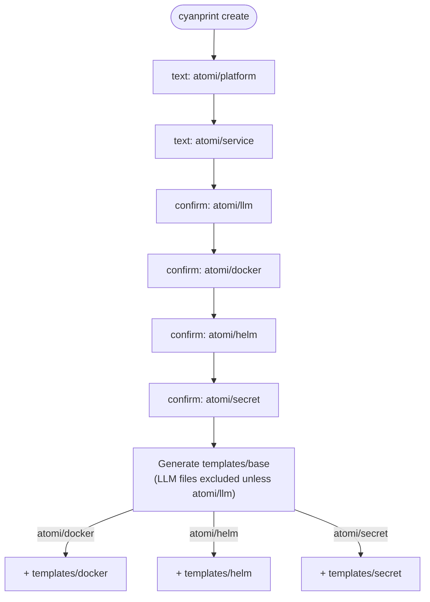

# atomi/workspace

AtomiCloud's default workspace scaffold.

This CyanPrint template generates a standard AtomiCloud workspace. A base layer is always generated (developer docs, CI/CD workflows, Nix shells, Taskfile, linting, semantic-release, service-tree conventions), and optional Docker, Helm, and Secret-management layers can be toggled on. The selected platform and service names from the LPSM service tree are substituted throughout.

## Usage

### Run directly

To create a new project from this template:

```bash
cyanprint create atomi/workspace
```

### Reference in a parent template

To use this template as a dependency in another CyanPrint template's `cyan.yaml`:

```yaml
templates: [atomi/workspace:1] # pin a version for reproducible builds
processors: [cyan/default]
```

## Prompts

When you run `cyanprint create`, the template asks the following questions:

| Prompt ID        | Description                                          | Type    |
| ---------------- | --------------------------------------------------- | ------- |
| `atomi/platform` | LPSM service-tree platform name (lower-cased)       | text    |
| `atomi/service`  | LPSM service-tree service name (lower-cased)         | text    |
| `atomi/llm`      | Enable LLM support — add `CLAUDE.md` and Claude skills | confirm |
| `atomi/docker`   | Enable Docker integration                           | confirm |
| `atomi/helm`     | Enable Helm chart integration                       | confirm |
| `atomi/secret`   | Enable secret management                            | confirm |

The `platform` and `service` answers populate the template variables used during generation. The four confirm prompts select which template layers are generated (and whether LLM files are kept).

### Question flow

All six prompts are always asked in order. The boolean answers then determine which processor layers run:



## Dependencies

| Name                   | Version | Purpose                          | Usage                                                                                                       |
| ---------------------- | ------- | -------------------------------- | ----------------------------------------------------------------------------------------------------------- |
| Bun                    | 1.3.8   | JavaScript/TypeScript runtime    | Runs the template entry point (`cyan/index.ts`) inside the template Docker image                            |
| `@atomicloud/cyan-sdk` | ^2.1.0  | CyanPrint template SDK           | Provides `StartTemplateWithLambda`, the `IInquirer` prompts (`i.text`, `i.confirm`), and `GlobType`         |
| `typescript`           | ^5.0.0  | Type checking (peer)             | Type support for the template source                                                                        |
| `cyan/default`         | latest  | Variable substitution            | Applied per layer (`templates/base` plus any of `docker`/`helm`/`secret`) to substitute `platform`/`service` |
| `atomi/nix`            | latest  | Nix scaffold sub-template        | Pulled in via `templates:`; answered with `cyan/nix/basic: yes`, `cyan/nix/llm: no`                          |
| `atomi/json-yaml`      | latest  | JSON/YAML merge resolver         | Merges overlapping CI/CD, Taskfile, dependabot, coderabbit, and release YAML across layers (`concat` arrays) |
| `atomi/md`             | latest  | Markdown merge resolver          | Merges `CLAUDE.md`, `README.md`, and `.envrc` produced by multiple layers                                    |
| `atomi/ignore`         | latest  | Ignore-file merge resolver       | Merges `.gitignore` and `.dockerignore` across layers                                                        |
| `atomi/nix`            | latest  | Nix merge resolver               | Merges `nix/*.nix` files across layers                                                                       |

### Variable syntax

The `cyan/default` processor is configured with three substitution delimiters, so variables can be injected in plain text and in commented code lines:

```
let__platform__
// let__service__
# let__platform__
```

## Build and Publish

### Build configuration (from `cyan.yaml`)

- **Registry**: `${DOMAIN:-docker.io}/${GITHUB_REPO_REF:-atomi}`
- **Platforms**: `linux/amd64`, `linux/arm64`
- **Images**:
  - `workspace` — template runtime (`cyan/Dockerfile`, context `./cyan`)
  - `workspace-blob` — blob storage (`cyan/blob.Dockerfile`, context `.`)
- **Post-generation command**: `chmod +x scripts/ci/*.sh 2>/dev/null || true`

### Publish

Authentication is required via the `--token` flag or the `CYAN_TOKEN` environment variable. The `--token` and `--message` flags must come before the `template` subcommand.

```bash
# Build and push (requires a tag for --build)
cyanprint push --token TOKEN --message "commit message" template --build v1.0.0

# Push only (no build)
cyanprint push --token TOKEN --message "commit message" template
```
