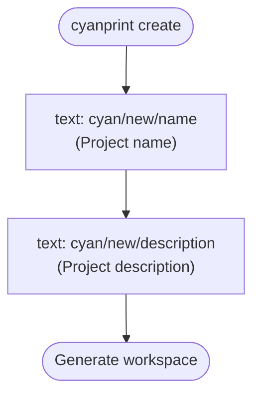

# atomi/workspace

AtomiCloud's default workspace scaffold.

This CyanPrint template generates a standard AtomiCloud workspace, including developer documentation (CI/CD, linting, semantic-release, service tree, shell scripts, and Taskfile conventions) with the project name and description substituted in.

## Usage

### Run directly

To create a new project from this template:

```bash
cyanprint create atomi/workspace
```

### Reference in a parent template

To use this template as a dependency in another CyanPrint template's `cyan.yaml`:

```yaml
templates: [atomi/workspace:1] # pin a version for reproducible builds
processors: [cyan/default]
```

## Prompts

When you run `cyanprint create`, the template asks the following questions:

| Prompt ID              | Description         | Type |
| ---------------------- | ------------------- | ---- |
| `cyan/new/name`        | Project name        | text |
| `cyan/new/description` | Project description | text |

The answers populate the `projectName` and `projectDescription` variables used during file generation.

### Question flow

The flow is linear — both prompts are always asked, in order, with no branching:



## Dependencies

| Name                   | Version | Purpose                       | Usage                                                                                              |
| ---------------------- | ------- | ----------------------------- | -------------------------------------------------------------------------------------------------- |
| Bun                    | 1.3.8   | JavaScript/TypeScript runtime | Runs the template entry point (`index.ts`) inside the template Docker image                        |
| `@atomicloud/cyan-sdk` | ^2.1.0  | CyanPrint template SDK        | Provides `StartTemplateWithLambda`, the `i` inquirer (`i.text`), and `GlobType` used in `index.ts` |
| `typescript`           | ^5.0.0  | Type checking (peer)          | Type support for the template source                                                               |
| `cyan/default`         | latest  | Variable substitution         | Processes files under `templates/` (glob `**/*`), substituting `projectName`/`projectDescription`  |

### Variable syntax

The `cyan/default` processor is configured with three substitution delimiters, so variables can be injected in plain text and in commented code lines:

```
{{ projectName }}
// {{ projectName }}
# {{ projectName }}
```

## Build and Publish

### Build configuration (from `cyan.yaml`)

- **Registry**: `${DOMAIN:-docker.io}/${GITHUB_REPO_REF:-atomi}`
- **Platforms**: `linux/amd64`, `linux/arm64`
- **Images**:
  - `workspace` — template runtime (`cyan/Dockerfile`, context `./cyan`)
  - `workspace-blob` — blob storage (`cyan/blob.Dockerfile`, context `.`)
- **Post-generation command**: `chmod +x scripts/*.sh 2>/dev/null || true`

### Publish

Authentication is required via the `--token` flag or the `CYAN_TOKEN` environment variable. The `--token` and `--message` flags must come before the `template` subcommand.

```bash
# Build and push (requires a tag for --build)
cyanprint push --token TOKEN --message "commit message" template --build v1.0.0

# Push only (no build)
cyanprint push --token TOKEN --message "commit message" template
```
